# Horizon v0.6.0 [](https://godoc.org/github.com/LdDl/horizon) [](https://travis-ci.com/LdDl/horizon) [](https://sourcegraph.com/github.com/LdDl/horizon?badge) [](https://goreportcard.com/report/github.com/LdDl/horizon) [](https://github.com/LdDl/horizon/releases)

# Work in progress
Horizon is project aimed to do map matching (snap GPS data to map) and routing (find shortest path between two points)

## Table of Contents
- [About](#about)
- [Installation](#installation)
- [Usage](#usage)
- [Benchmark](#benchmark)
- [Support](#support)
- [ToDo](#todo)
- [Theory](#theory)
- [Dependencies](#dependencies)
- [License](#license)

## About
Horizon is targeted to make map matching as [OSRM](https://github.com/Project-OSRM/osrm-backend) / [Graphopper](https://github.com/graphhopper/graphhopper) or [Valhala](https://github.com/valhalla/valhalla) have done, but in Go ecosystem.

Demonstration:
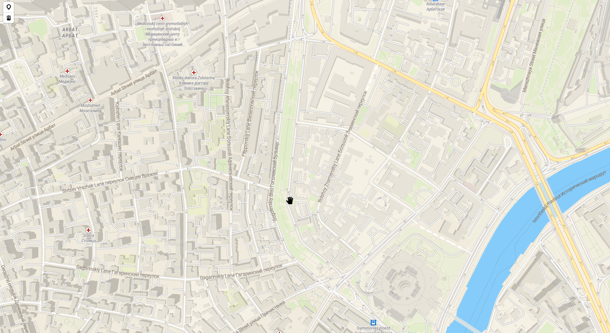

## Installation
Via _go get_:
```shell
go get github.com/LdDl/horizon
go install github.com/LdDl/horizon/cmd/horizon@v0.6.0
```

Via downloading prebuilt binary and making updates in yours PATH environment varibale (both Linux and Windows):
* Windows - https://github.com/LdDl/horizon/releases/download/v0.6.0/windows-horizon.zip
* Linux - https://github.com/LdDl/horizon/releases/download/v0.6.0/linux-amd64-horizon.tar.gz

Check if **horizon** binary was installed properly:
```shell
horizon -h
```

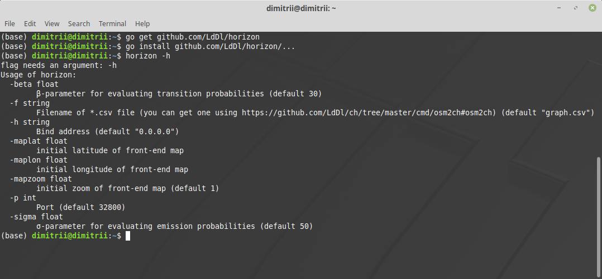

## Usage
### notice: targeted for Linux users (no Windows/OSX instructions currenlty)
Instruction has been made for Linux mainly. For Windows or OSX the way may vary.

0. Installing Prerequisites


    * Install [osm2ch tool](https://github.com/LdDl/osm2ch#osm2ch). It's needed for converting *.osm.pbf file to CSV for proper usage in [contraction hierarchies (ch) library](https://github.com/LdDl/ch#ch---contraction-hierarchies)
        ```shell
        go install github.com/LdDl/osm2ch/cmd/osm2ch@v1.5.1
        # for disabling zlib:
        export CGO_ENABLED=0 && go install github.com/LdDl/osm2ch/cmd/osm2ch@v1.5.1
        ```
    * Check if **osm2ch** binary was installed properly:
        ```shell
        osm2ch -h
        ```
        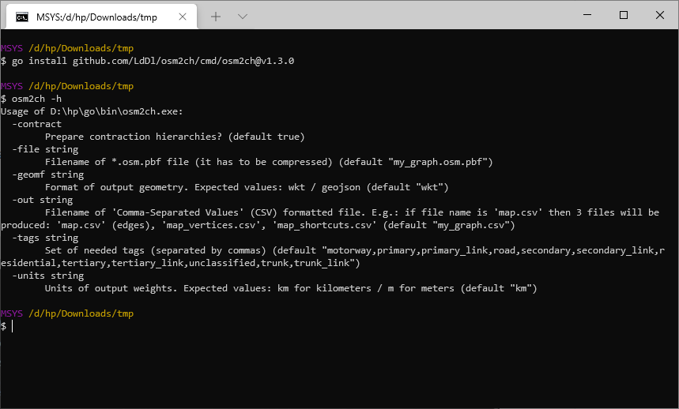
    
    * Install [osmconvert tool](https://wiki.openstreetmap.org/wiki/Osmconvert). It's needed for removing excess data from road graph and compressing *.osm file. You can follow the [link](https://wiki.openstreetmap.org/wiki/Osmconvert#Binaries) for theirs instruction.
    We advice to use this method (described in [Source](https://wiki.openstreetmap.org/wiki/Osmconvert#Source) paragraph):
        ```shell
        wget -O - http://m.m.i24.cc/osmconvert.c | sudo cc -x c - -lz -O3 -o osmconvert && sudo mv osmconvert /usr/local/bin/
        ```
    * Check if **osmconvert** binary was installed properly:
        ```shell
        osmconvert -h
        ```
        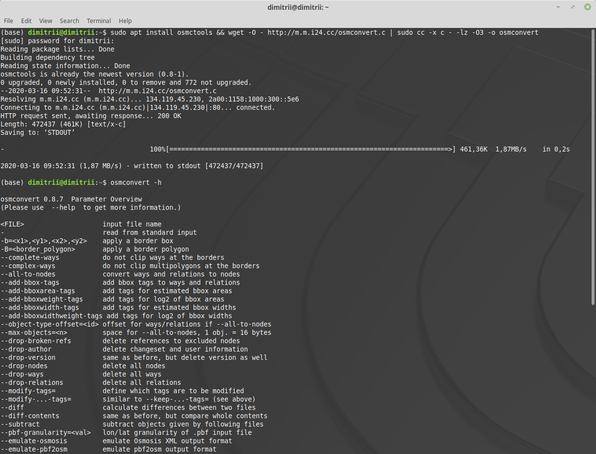

1. First of all (except previous step), you need to download road graph (OSM is most popular format, we guess). Notice: you must change bbox for your region (in this example we using central district of Moscow).
    ```shell
    wget 'https://overpass-api.de/api/map?bbox=37.5453,55.7237,37.7252,55.7837' -O map.osm
    # or curl 'https://overpass-api.de/api/map?bbox=37.5453,55.7237,37.7252,55.7837' --output map.osm
    ```
    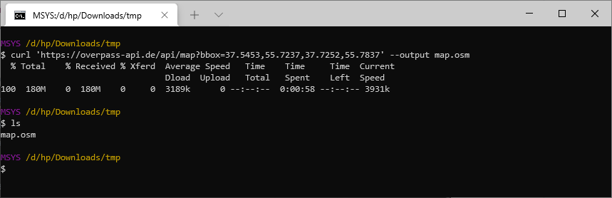

2. Compress *.osm file via [osmconvert](https://wiki.openstreetmap.org/wiki/Osmconvert).
    ```shell
    osmconvert map.osm --out-pbf -o=map.osm.pbf
    # If you want skip authors/versions
    # osmconvert map.osm --drop-author --drop-version --out-pbf -o=map.osm.pbf
    ```
    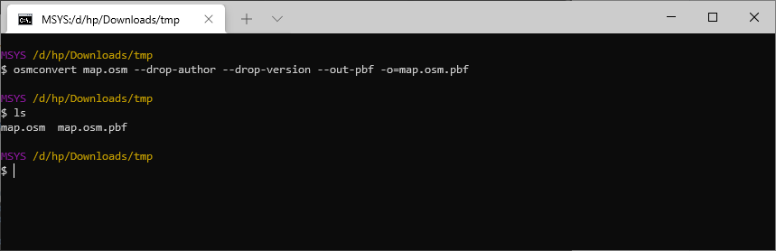

3. Convert *.osm.pbf to CSV via [osm2ch](https://github.com/LdDl/osm2ch#osm2ch).

    Notice:
    * osm2ch's default output geometry format is WKT and units is 'km' (kilometers). We are going to change those default values. We are going to extract only edges adapted for cars also. 
    * Don't forget to prepare contraction hierarchies via flag 'contract=true'

    ```shell
    osm2ch --file map.osm.pbf --out map.csv --geomf geojson --units m --tags motorway,primary,primary_link,road,secondary,secondary_link,residential,tertiary,tertiary_link,unclassified,trunk,trunk_link --contract=true
    ```
    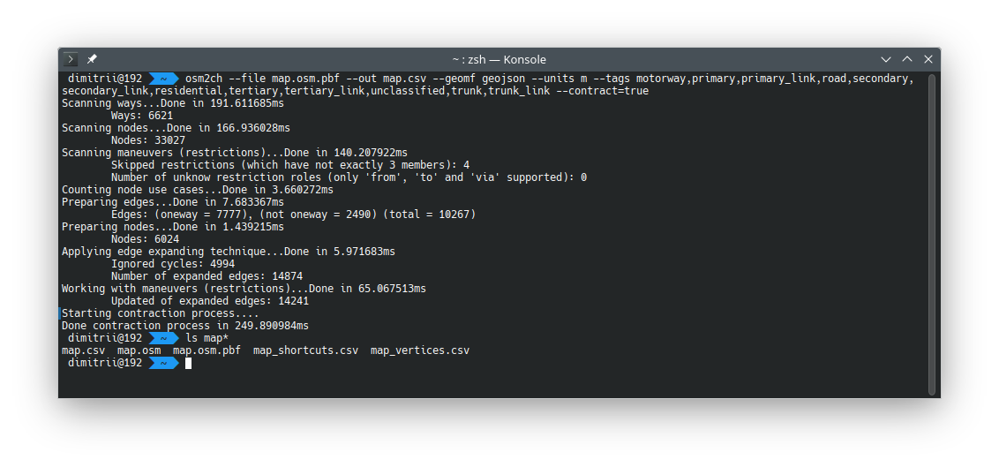

4. After step above there must be 3 files:
    * map.csv - Information about edges and its geometries
    * map_vertices.csv - Information about vertices and its geometries
    * map_shortcuts.csv - Information about shortcuts which are obtained by contraction process

5. Start **horizon** server. Provide bind address, port, filename for edges file, σ and β parameters, initial longitude/latitude (in example Moscow coordinates are provided) and zoom for web page of your needs. 
    ```shell
    horizon -h 0.0.0.0 -p 32800 -f map.csv -sigma 50.0 -beta 30.0 -maplon 37.60011784074581 -maplat 55.74694688386492 -mapzoom 17.0
    ```
    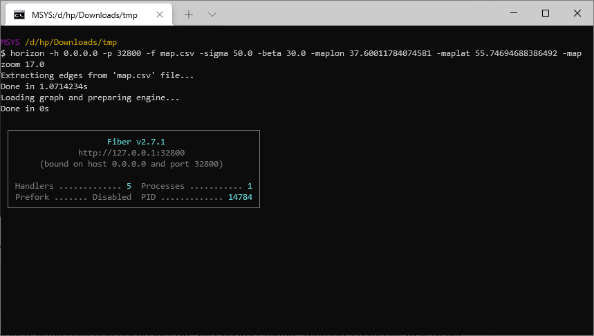

    5.1. If you need to enable gRPC API use flags `grpc`, `gh` and `gp`, e.g.:

    ```shell
    horizon -h 0.0.0.0 -p 32800 -f map.csv -sigma 50.0 -beta 30.0 -maplon 37.60011784074581 -maplat 55.74694688386492 -mapzoom 17.0 -grpc true -gh 0.0.0.0 -gp 32801
    ```

6. Check if server works fine via POST-request (we are using [cURL](https://curl.haxx.se)). Notice: order of provided GPS-points matters.
    ```shell
    curl 'http://localhost:32800/api/v0.1.0/mapmatch' \
        -X POST \
        -H 'Accept: application/json' \
        -H 'Content-Type: application/json' \
        --data-raw '{"max_states":5,"state_radius":7.0,"gps":[{"tm":"2024-11-30T00:00:00","lon_lat":[37.601249363208915,55.745374309126895]},{"tm":"2024-11-30T00:00:02","lon_lat":[37.600552781226014,55.7462238201015]},{"tm":"2024-11-30T00:00:04","lon_lat":[37.59995939657391,55.747450858855984]},{"tm":"2024-11-30T00:00:06","lon_lat":[37.60052698189332,55.7480171714195]},{"tm":"2024-11-30T00:00:08","lon_lat":[37.600655978556816,55.748728680680564]},{"tm":"2024-11-30T00:00:10","lon_lat":[37.600372185897115,55.74945469716283]},{"tm":"2024-11-30T00:00:12","lon_lat":[37.600694677555865,55.75052191686339]},{"tm":"2024-11-30T00:00:14","lon_lat":[37.600965570549214,55.751371315759044]},{"tm":"2024-11-30T00:00:16","lon_lat":[37.600926871550165,55.752634490168425]},{"tm":"2024-11-30T00:00:18","lon_lat":[37.60038508556347,55.75559625596534]}]}' ; echo
    ```
    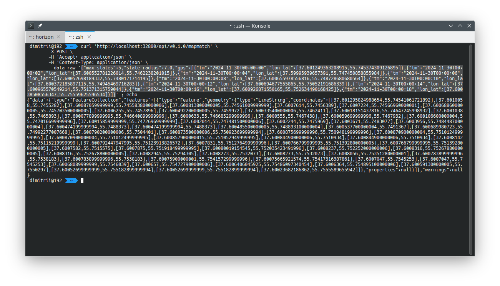

    For shortest path finding (_note: edge selection based just on "first nearest found" method, so results may make you upset_):
    ```shell
    curl 'http://localhost:32800/api/v0.1.0/shortest' \
        -X POST \
        -H 'accept: application/json' \
        -H  'Content-Type: application/json' \
        --data-raw '{"state_radius":10.0,"gps":[{"lon_lat":[37.601249363208915,55.745374309126895]},{"lon_lat":[37.600926871550165,55.752634490168425]}]}' ; echo
    ```
    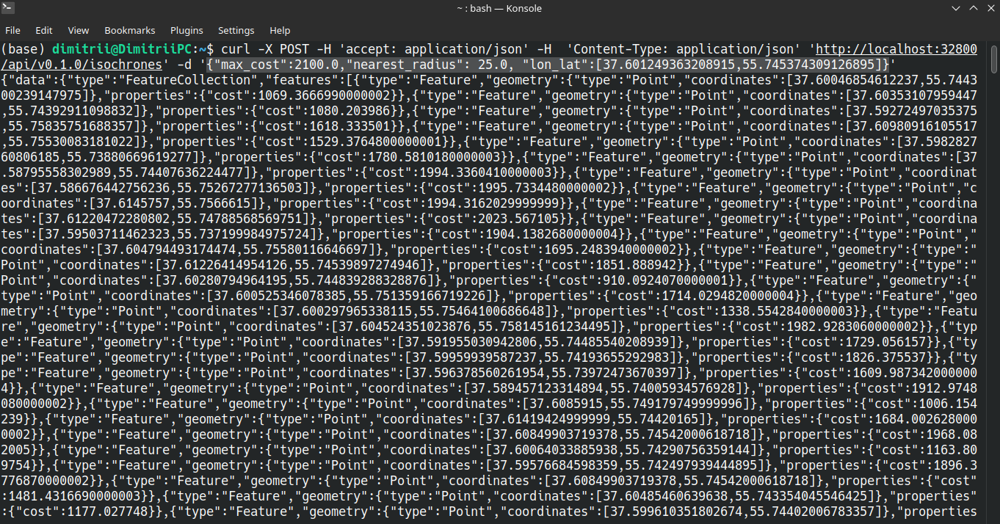

    For isochrones estimation (_note: maxCost => it represents meters in current example_):
    ```shell
    curl 'http://localhost:32800/api/v0.1.0/isochrones' \
        -X POST \
        -H 'accept: application/json' \
        -H  'Content-Type: application/json' \
        --data-raw '{"max_cost":2100.0,"nearest_radius": 25.0, "lon_lat":[37.601249363208915,55.745374309126895]}' ; echo
    ```
    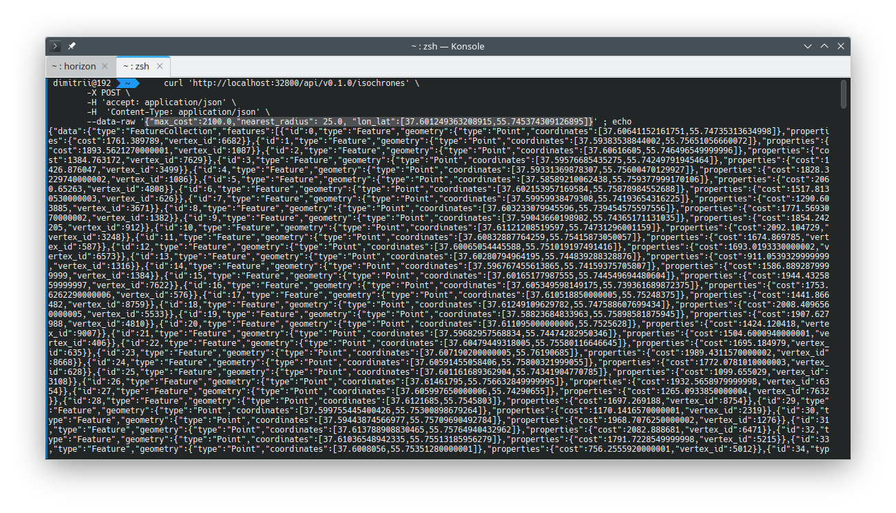

7. Open Front-end on link http://localhost:32800/

    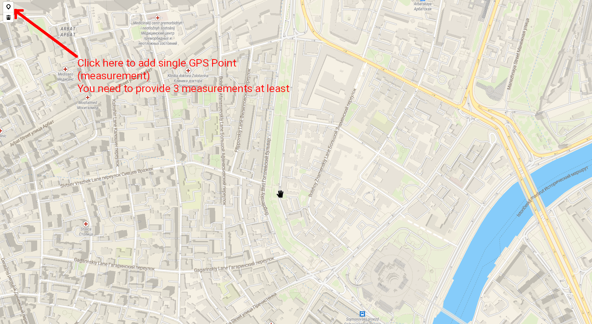
    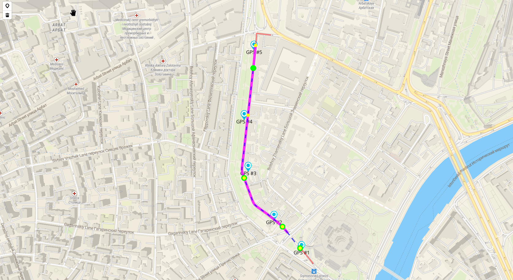

    - Blue - observation point (measurement)
    - Purple - represents matched edge
    - Yellow - represents projection of the point onto the matched edge
    - Green - represents picked either source or target vertex of the matched edge
    - Red - represents cuts of excessed geometries (for first and last matched edges)
    - Dark Blue - represents intermediate edges (i.e. there are some edges between two matched edges)
    

8. There is also [Swagger](https://en.wikipedia.org/wiki/Swagger_(software)) documentation for inialized REST API.

    If you use http://localhost:32800/ then you can navigate to http://localhost:32800/api/v0.1.0/docs/index.html#overview for API documentation. It may look like (thanks [rapidoc](https://github.com/mrin9/RapiDoc#rapidoc)):
    
    

## Benchmark
Please follow [link](BENCHMARK.md)

## Support
If you have troubles or questions please [open an issue](https://github.com/LdDl/ch/issues/new).
Feel free to make PR's (we do not have contributing guidelines currently, but we will someday)

## ToDo
Please see [ROADMAP.md](ROADMAP.md)

## Theory
Thanks for approach described in this paper:
**Newson, Paul, and John Krumm. "Hidden Markov map matching through noise and sparseness." Proceedings of the 17th ACM SIGSPATIAL International Conference on Advances in Geographic Information Systems. ACM, 2009**

[Hidden Markov model](https://en.wikipedia.org/wiki/Hidden_Markov_model) is used as backbone for preparing probabities for Viterbi algorithm. Notice that we do not use 'classical' [Normal distribution](https://en.wikipedia.org/wiki/Normal_distribution) for evaluating emission probabilty or [Exponential distribution](https://en.wikipedia.org/wiki/Exponential_distribution) for evaluatuin transition probabilties in HMM. Instead of it we use **Log-normal distribution** for emissions and **Log-exponential distribution** for transitions. Why is that? Because we do not want to get underflow (arithmetic) for small probabilities

[Viterbi algorithm](https://en.wikipedia.org/wiki/Viterbi_algorithm) is used to evaluate the most suitable trace of GPS track.

## Dependencies
* Contraction hierarchies library with bidirectional Dijkstra's algorithm - [ch](https://github.com/LdDl/ch#ch---contraction-hierarchies). License is Apache-2.0
* Viterbi's algorithm implementation - [viterbi](https://github.com/LdDl/viterbi#viterbi). License is Apache-2.0
* S2 (spherical geometry) library - [s2](https://github.com/golang/geo#overview). License is Apache-2.0
* Btree implementation - [btree](https://github.com/google/btree#btree-implementation-for-go). License is Apache-2.0
* GeoJSON stuff - [go.geojson](https://github.com/paulmach/go.geojson#gogeojson). License is MIT
* Fiber framework (used for server app) - [Fiber](https://github.com/gofiber/fiber). License is MIT
* ~~MapboxGL for Front-end - [mapboxgl](https://github.com/mapbox/mapbox-gl-js). License is 3-Clause BSD license~~
Replaced with Maplibre due Mapbox [changed license](https://github.com/mapbox/mapbox-gl-js/releases/tag/v2.0.0). License is modified 3-Clause BSD license, please see [ref. link](https://github.com/maplibre/maplibre-gl-js/blob/main/LICENSE.txt)
* moments.js for Front-end - [moment.js](https://github.com/moment/moment/). License is MIT
* rapidoc for [swagger](https://en.wikipedia.org/wiki/Swagger_(software)) visualization - [rapidoc](https://github.com/mrin9/RapiDoc/blob/master/LICENSE.txt). License is MIT

## License
You can check it [here](https://github.com/LdDl/horizon/blob/master/LICENSE)

